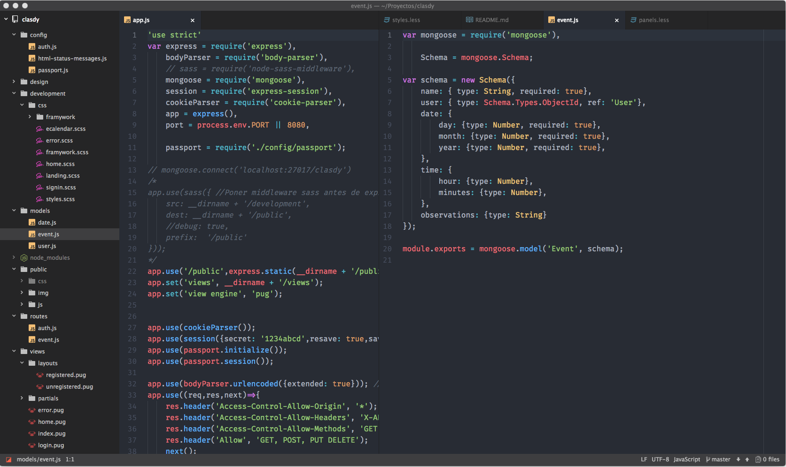
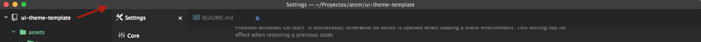
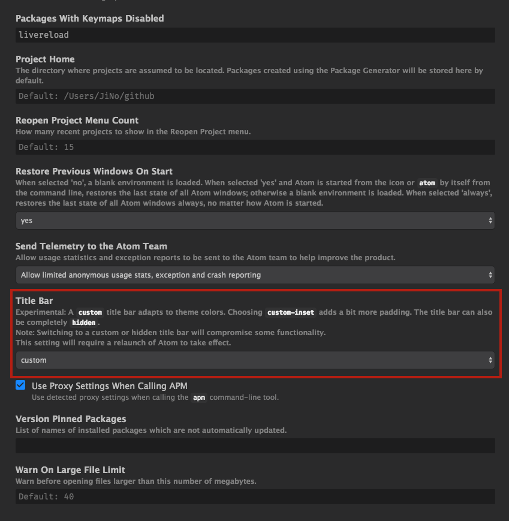
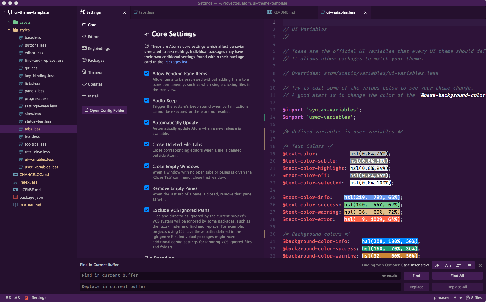

# Viscode UI Theme

Theme for Atom Editor based on Visual Studio Code.

syntax theme: One dark


### Settings
If you want to have a customizable color in the header of Atom



you must go `settings -> core -> title bar` and set it to `custom`.



### Customize
You can customize the theme by changing the values of `~/.atom/packages/viscode-ui/styles/user-variables`

**Note**: You must restart Atom after modification.

#### Default values
```less
@base-background-color:           #252526;
@header-panel-background-color:   lighten(@base-background-color, 10%);
@tab-background-color:            @base-background-color;
@tree-view-background-color:      @base-background-color;
@footer-panel-backgrund-color:    @header-panel-background-color;
```

#### EXAMPLE

```less
@base-background-color: #25102E;
```

syntax theme: [one-purple-syntax](https://atom.io/themes/one-purple-syntax)

